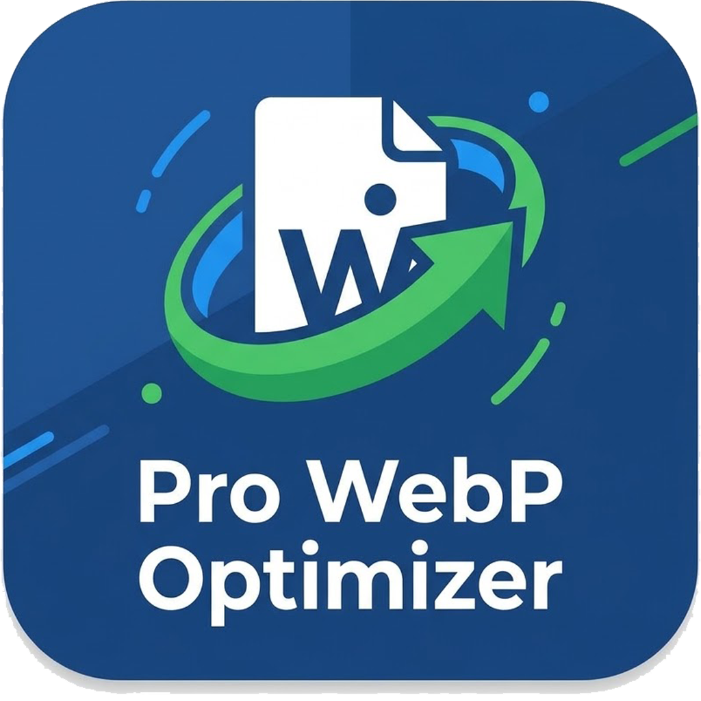
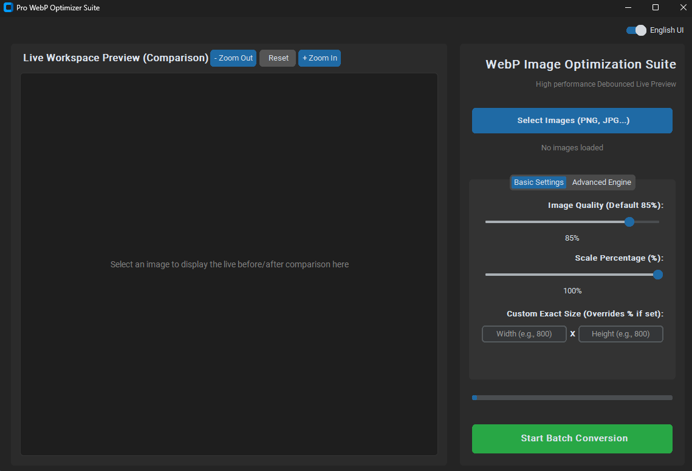
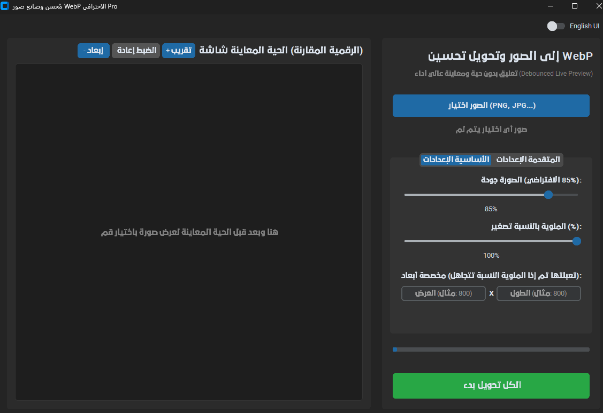

<div align="center">
  

  # Pro WebP Optimizer Suite
  **Ultimate Batch Image Compressor & WebP Converter**

  
  
  
  
  
</div>

<br>

**Pro WebP Optimizer Suite** is a powerful, open-source desktop application built with Python to optimize, compress, and bulk-convert images (PNG, JPG, JPEG) to the next-generation **WebP format**. 

Designed specifically for **Web Developers, SEO Experts, and E-commerce Owners**, this tool drastically reduces image file sizes without compromising visual quality. Boost your website's loading speed, improve your **Core Web Vitals**, and rank higher on Google by serving highly optimized WebP images!

---

## 📸 Application Interface

<div align="center">
  <table>
    <tr>
      <th align="center">English Interface 🇺🇸</th>
      <th align="center">Arabic Interface 🇸🇦</th>
    </tr>
    <tr>
      <td align="center"></td>
      <td align="center"></td>
    </tr>
  </table>
</div>

---

## ✨ Key Features & Capabilities

* **⚡ Debounced Live Preview:** Features an advanced RAM-based simulation engine. See exactly how your compressed WebP image will look, along with real-time file size estimates and compression percentages, *before* you save it.
* **🚀 Lightning-Fast Batch Processing:** Bulk convert hundreds of high-resolution images instantly. Utilizes multi-threading background processing for a lag-free experience.
* **🔍 Pixel-Perfect Zoom Controls:** Inspect your original vs. optimized images up close with built-in Zoom In/Out capabilities to guarantee zero loss in product details.
* **🎛️ Advanced Resizing & Scaling:** Resize images dynamically by a **Scale Percentage (%)** or force **Custom Exact Dimensions (Width x Height)** for responsive web design.
* **💯 Smart Lossless Compression:** Use the adjustable quality slider for lossy compression, or toggle **Lossless mode** for zero-quality-loss optimization.
* **🔒 Privacy & Metadata Control (EXIF):** Choose to keep or strip EXIF metadata (camera info, GPS location) to protect user privacy and shave off extra kilobytes. 100% offline—no cloud uploads required!
* **🌍 Bilingual UI:** Seamlessly switch between **English** and **Arabic** interfaces with a modern Dark-Mode GUI.
* **📊 Detailed Storage Stats:** Get a clear post-conversion report showing exactly how much disk space you saved (in MB and %).

---

## 💡 Why Use Pro WebP Optimizer? (Use Cases)

* **📈 SEO & Core Web Vitals:** Google loves fast websites. Converting heavy JPG/PNGs to WebP is the #1 recommendation by Google PageSpeed Insights to improve LCP (Largest Contentful Paint).
* **🛒 E-Commerce Platforms (Shopify, WooCommerce):** Reduce bounce rates by ensuring your high-quality product images load instantly for mobile users.
* **👨‍💻 Web Development:** A secure, local alternative to paid cloud image compressors like TinyPNG. Your files stay securely on your machine.

---

## 🛠️ Built With

* **[Python 3](https://www.python.org/):** Core application logic and multi-threading.
* **[CustomTkinter](https://github.com/TomSchimansky/CustomTkinter):** For a beautiful, modern, dark-mode first Graphical User Interface (GUI).
* **[Pillow (PIL)](https://python-pillow.org/):** Advanced image processing and reliable WebP encoding engine.

---

## 📥 Download & Usage

### 🚀 Option 1: The Easy Way (Download Portable EXE)
No Python installation required! Just download the standalone Windows executable and start compressing.
1. Go to the **[Releases Page](../../releases/latest)**.
2. Download **`Pro-WebP-Optimizer.exe`**.
3. Double-click to run. It's completely portable and includes our custom sleek icon.

---

### 💻 Option 2: For Developers (Run from Source)
If you want to run the source code, modify it, or build it yourself:

**1. Clone the repository:**
```bash
git clone [https://github.com/Turki-Alshaikh/Pro-WebP-Optimizer.git](https://github.com/Turki-Alshaikh/Pro-WebP-Optimizer.git)
cd Pro-WebP-Optimizer

```

**2. Install dependencies:**

```bash
pip install customtkinter Pillow

```

**3. Run the application:**

```bash
python Pro-WebP-Optimizer.py

```

**4. Build your own EXE (Optional):**
To compile the script into a standalone executable with the custom `icon.ico` included:

```bash
pip install pyinstaller
pyinstaller --noconsole --onefile --collect-all customtkinter --icon=icon.ico Pro-WebP-Optimizer.py

```

*(Your optimized `.exe` file will be generated inside the `dist` folder).*

---

## 🤝 Contributing

Contributions, issues, and feature requests are welcome!
Feel free to check the [issues page](https://www.google.com/search?q=../../issues&utm_source=gemini) if you want to contribute.

## ⭐️ Show your support

If this tool helped you save space, speed up your website, or improve your SEO, please **give this repository a ⭐️ Star**! It helps the project grow and reach more developers.

##  Support the Developer

This project is 100% open-source and provided freely to support the developer community. If this tool has saved you time or added value to your workflow, you can support its continuous development by checking out our digital store:

**[Mfatihy Store (متجر مفاتيحي)](https://mfatihy.com)** is your premier and trusted destination in Saudi Arabia and the GCC for **[genuine software licenses](https://mfatihy.com)**. We provide lifetime **[Windows & Microsoft Office activation keys](https://mfatihy.com/windows-keys/c1242520213)**, alongside professional design and engineering software subscriptions at highly competitive prices, ensuring instant delivery and secure activation.

[](https://mfatihy.com)
## 📝 License

This project is [MIT](https://www.google.com/search?q=LICENSE&utm_source=gemini) licensed. Free to use, modify, and distribute.

